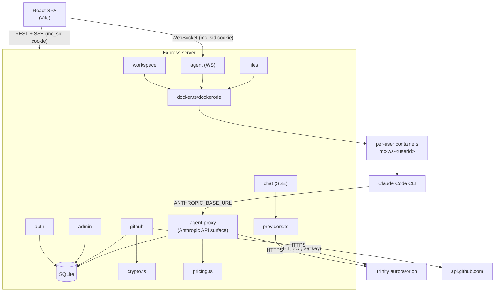

# MiniChat — Architecture

MiniChat is a "Claude Code Web" clone: a ChatGPT-style UI for chatting with
Trinity-proxied LLMs, plus a per-user agent workspace. Each user gets a
persistent Docker container in which the **Claude Code CLI** runs as an
autonomous agent on a real filesystem, with full shell, git, and GitHub access.
Every token the agent spends is billed against the user's shared balance through
a server-side proxy — Trinity API keys never enter a container.

## High-level topology

```
                            ┌──────────────────────────────────────────┐
                            │            Browser (React SPA)             │
                            │  Chat view · Agent view · Files · GitHub   │
                            └───────────────┬───────────────┬───────────┘
                          REST + SSE (cookie)│               │ WebSocket (cookie)
                                             ▼               ▼
              ┌───────────────────────────────────────────────────────────────┐
              │                  Express server (Node, tsx/TS)                  │
              │                                                                 │
              │  auth · chat(SSE) · admin · workspace · agent · files · github  │
              │  agent-proxy (Anthropic Messages API surface)                   │
              │  lib: db(SQLite) · docker(dockerode) · crypto · pricing · ws    │
              └───┬───────────────┬───────────────────────┬───────────────┬────┘
                  │ better-sqlite3│ dockerode (unix socket)│ fetch (HTTPS)  │ fetch (HTTPS)
                  ▼               ▼                        ▼                ▼
            ┌──────────┐   ┌───────────────────────┐  ┌──────────┐   ┌──────────┐
            │ SQLite   │   │  Docker daemon         │  │ Trinity  │   │ GitHub   │
            │ data/    │   │  per-user containers   │  │ aurora / │   │ api.     │
            │ minichat │   │  mc-ws-<userId>        │  │ orion    │   │ github   │
            │ .db      │   │  + volume mc-ws-<id>   │  └──────────┘   └──────────┘
            └──────────┘   └───────────┬───────────┘
                                       │ ANTHROPIC_BASE_URL = host.docker.internal
                                       │ ANTHROPIC_API_KEY  = wsk_… (workspace token)
                                       ▼
                          ┌──────────────────────────────┐
                          │ Claude Code CLI in container  │
                          │  claude -p … stream-json      │
                          │  cwd /workspace (volume)      │
                          └───────────────┬───────────────┘
                                          │ calls back into the server
                                          ▼
                                  /api/agent-proxy/v1/messages
                                  (auth wsk_ token → forward to Trinity → bill)
```

The same data also expressed as a component graph:



## Components

### Client (`client/`)
React 19 + Vite + TypeScript + Tailwind CSS v4. Single-page app. Talks to the
server over REST (`fetch`, `credentials: "include"`), SSE (chat streaming), and
WebSocket (agent runs). Conversation state for plain chat lives in
`localStorage`; agent sessions live server-side in `agent_sessions`.

Key modules:
- `auth/AuthProvider.tsx` — auth context (user, login/register/logout/refresh).
- `hooks/useChat.ts` — SSE chat stream parser.
- `hooks/useAgent.ts` — WebSocket agent run hook (Phase 4).
- `lib/api.ts` — REST + SSE + WS helpers.
- Components: `Sidebar`, `ChatWindow`, `InputBar`, `RightPanel`, `AdminPanel`,
  `AccountMenu`, plus agent / files / github views.

### Server (`server/`)
Express + TypeScript run under `tsx` (dev) / compiled to `dist` (prod). ESM
modules with explicit `.js` import extensions.

Libraries (`server/lib/`):
- `db.ts` — better-sqlite3 connection, schema, migrations (run at boot).
- `auth.ts` — bcrypt, sessions, cookie, `requireAuth` / `requireAdmin`.
- `pricing.ts` — per-model prices + `calcCost`; prefix-price fallback for the
  full Anthropic model IDs the CLI sends.
- `providers.ts` — Trinity OpenAI/Anthropic chat streaming.
- `docker.ts` — dockerode workspace manager (volume/container lifecycle, exec,
  disk usage, idle reaper). Throws `DockerUnavailableError` → routes map to 503.
- `crypto.ts` — AES-256-GCM secret encryption (PATs) + workspace-token mint.
- `wsPath.ts` — path-traversal guard for the files API.
- `rateLimit.ts` — express-rate-limit limiters (login/register/redeem/chat/
  agent-proxy/files).
- `agentTypes.ts` — shared client/server contracts (WS protocol + REST DTOs).
- `env.ts` — env validation + workspace config accessors.

Routes (`server/routes/`):
- `auth.ts`, `chat.ts`, `admin.ts` — existing surface.
- `workspace.ts` — per-user container lifecycle (start/stop/reset/status).
- `agent.ts` — agent session CRUD + the `/api/agent/ws` WebSocket runner.
- `agent-proxy.ts` — Anthropic Messages API surface the in-container CLI calls.
- `files.ts` — file browser/editor over the container.
- `github.ts` — PAT storage + clone.

### Docker layer
The server controls Docker via the host socket (`dockerode`). Per user:
- **Volume** `mc-ws-<userId>` mounted at `/workspace` — permanent, survives
  container restarts.
- **Container** `mc-ws-<userId>` — on-demand, hardened (non-root `node`,
  `no-new-privileges`, 2 GiB mem / 2 CPU / 512 pids, no docker socket inside),
  kept alive with `sleep infinity` and driven by `docker exec`.
- Idle-reaper stops containers idle longer than `WORKSPACE_IDLE_MINUTES`.

See `docs/adr/ADR-001-workspace-runtime.md`.

## Billing flow

Balance is a single integer `users.token_balance` in "cost units". Pricing is in
`pricing.ts`: `cost = ceil((price_in * inTok + price_out * outTok) / 1000)`.
Both billing paths use the same **hold → settle** pattern: a pre-flight maximum
cost is atomically deducted (the "hold"), then reconciled against real usage
when the response completes (refund the difference, or charge a bit more), and a
`usage_log` row is written. Client disconnect mid-stream refunds the hold.

### Chat path (`routes/chat.ts`)
```
Browser ──POST /api/chat (SSE)──▶ server
  validate · 402 if balance ≤ 0
  hold = calcCost(model, estIn, MAX_OUT); atomic deduct
  stream from Trinity (providers.ts) ── data:{content} … ──▶ Browser
  on usage: settle(real) → write usage_log → data:{usage} → data:[DONE]
```

### Agent path (`routes/agent.ts` + `routes/agent-proxy.ts`)
The agent path has **two** server touchpoints. The WebSocket runner orchestrates
the CLI; the proxy does the actual billing.

```
Browser ──WS /api/agent/ws?session=id──▶ agent runner
  ensureWorkspace · balance/quota check
  docker exec: claude -p <prompt> --output-format stream-json [--resume]
       │
       │ the CLI issues Anthropic Messages API calls:
       ▼
  container ──POST host.docker.internal/api/agent-proxy/v1/messages──▶ agent-proxy
       x-api-key: wsk_…  (workspace token)
       auth: bcrypt-compare vs workspaces.ws_token_hash → resolve user
       402 if balance ≤ 0
       hold = calcCost(model, approxIn, max_tokens); atomic deduct
       forward verbatim to Trinity aurora with the REAL key
       tee-parse SSE message_start/message_delta for usage
       settle(real) → write usage_log
       │
       ▼ (CLI NDJSON events stream back out)
  runner parses NDJSON → assistant_text / tool_use / tool_result / result
  persist to agent_events · relay typed AgentServerMessage over WS ──▶ Browser
```

Key property: the CLI believes it is talking to Anthropic. The real Trinity key
lives only on the server; the container only ever holds an opaque `wsk_` token
that is bcrypt-hashed in the DB. `usage_log` is the source of truth for billing;
the CLI's own `total_cost_usd` is informational only.

## WebSocket agent streaming

`GET /api/agent/ws?session=<id>` (the `ws` package, upgraded on the same HTTP
server). Auth on upgrade uses the same `mc_sid` cookie; the session must belong
to the connecting user and the user must be active.

- Client → server: `{type:"prompt", text, model?}`, `{type:"cancel"}`.
- Server → client (`lib/agentTypes.ts` `AgentServerMessage`): `status`,
  `assistant_text`, `tool_use`, `tool_result`, `result` (cost/balance/tokens),
  `error`.
- Every event is persisted to `agent_events` for run history.
- On the CLI `result` event, the CLI session id is captured into
  `agent_sessions.cli_session_id` so the next prompt resumes with `--resume`.

See `docs/adr/ADR-004-agent-streaming.md`.

## Data model

SQLite (`data/minichat.db`), WAL mode, foreign keys ON. Schema + migrations are
created idempotently at boot in `lib/db.ts`.

### Existing tables (auth/billing base)
| Table | Purpose |
|---|---|
| `users` | id, username, password_hash, role (user\|admin), status (active\|suspended\|banned), token_balance, created_at |
| `sessions` | id, user_id, created_at, expires_at — httpOnly cookie `mc_sid`, 30d TTL |
| `invite_codes` | code, created_by, used_by/used_at — one-time `INV-XXXX-XXXX` registration codes |
| `token_codes` | code, amount, created_by, used_by/used_at — one-time `TKN-XXXX-XXXX` balance top-ups |
| `usage_log` | id, user_id, model, input_tokens, output_tokens, cost, created_at — every billed request (chat AND agent) |
| `admin_audit_log` | id, admin_id, action, target_id, payload, created_at — admin mutation trail |

### Claude Code Web tables
| Table | Purpose |
|---|---|
| `workspaces` | user_id PK, volume_name, container_id, status (none\|starting\|running\|stopped\|error), last_activity_at, disk_used_bytes, disk_quota_bytes (NULL = unlimited, admins), ws_token_hash (bcrypt of workspace billing token), created_at |
| `github_tokens` | user_id PK, token_encrypted (AES-256-GCM `iv:tag:ciphertext`), github_username, connected_at |
| `agent_sessions` | id, user_id, title, cli_session_id (for `--resume`), status (idle\|running\|error), created_at, updated_at |
| `agent_events` | id, session_id, type, payload_json, created_at — persisted agent run event stream |

Relationships: `sessions`, `usage_log`, `workspaces`, `github_tokens`,
`agent_sessions` all FK to `users(id)` with `ON DELETE CASCADE`; `agent_events`
FK to `agent_sessions(id)` cascade. Deleting a user therefore tears down their
sessions, usage history, workspace row, PAT, and agent history (but **not** the
docker volume — wipe that explicitly via the admin "delete workspace" action).

## Security boundaries

- **Trinity keys never enter a container.** The container gets an opaque `wsk_`
  token; the real key is used only by the server when forwarding to Trinity.
- **Container hardening:** non-root, `no-new-privileges`, mem/cpu/pid limits,
  no docker socket mounted inside, label-scoped enumeration (`minichat.user`).
- **Path traversal guard** (`wsPath.ts`) on every files API path.
- **PAT encryption** at rest (AES-256-GCM); never returned to the client.
- **IDOR:** user-facing workspace/files/agent/github routes scope strictly to
  `req.user.id` — no userId is accepted from the client. Admin routes that take
  `:userId` are behind `requireAdmin`.
- **Rate limiting** on login/register/redeem/chat/agent-proxy/files.
- **WS auth** on upgrade via the `mc_sid` cookie.

See the ADRs in `docs/adr/` for the full rationale of each decision.
